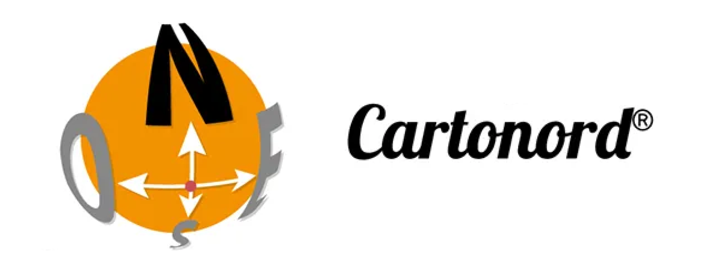

# Cartonord

A full-stack geospatial application for creating and serving custom styled vector tile maps from GeoJSON data.

## Architecture

This project consists of 4 microservices:

- **front** - React frontend with MapLibre GL JS for map editing and visualization
- **back** - Node.js/Express API server for data management
- **tile-server** - Express server for serving vector tiles from MBTiles files
- **tiler** - Microservice for generating tilesets using Tippecanoe

## Features

- Import GeoJSON layers with custom styling (colors, opacity, z-index)
- Interactive map editor with point of interest management
- Vector tile generation and serving
- PostgreSQL + PostGIS for geospatial data storage
- Docker containerized deployment

## Run the application

To run the application, simply run the following command :

`docker-compose up -d'

## API Endpoints

### Backend API (Port 3001)

- `POST /api/projects` - Create new map project
- `POST /api/projects/:id/layers` - Add GeoJSON layer
- `PUT /api/projects/:id/style` - Update styling
- `POST /api/projects/:id/generate-tileset` - Generate vector tiles

### Tiler (Port 3002)

- `POST /generate` - Generate tileset from uploaded GeoJSON file
- `POST /generate-from-data` - Generate tileset from GeoJSON data in request body
- `GET /project/:projectId` - List all tilesets for a project
- `DELETE /:tilesetId` - Delete a specific tileset

### Tile Server (Port 3003)

- `GET /tiles/{project-id}/{z}/{x}/{y}.pbf` - Serve vector tiles
- `GET /tiles/{project-id}/metadata` - Get tileset metadata
- `GET /projects` - List available projects

## Tech Stack

- **Frontend**: React, MapLibre GL JS, Vite, Nginx
- **Backend**: Node.js, Express.js
- **Database**: PostgreSQL w/ PostGIS
- **Tile Generation**: Node.js, Tippecanoe

## Environment Variables

Check individual service README files for specific configuration options.

## Data Flow

1. Import GeoJSON data via frontend
2. Backend processes and stores data in PostgreSQL
3. Tiler service generates MBTiles using Tippecanoe
4. Tile server serves vector tiles to map clients
5. Frontend displays styled maps using

## Licenses

[LICENSE.md](./assets/LICENSE.md) contains the full license information for this project, including third-party components like Tippecanoe.
